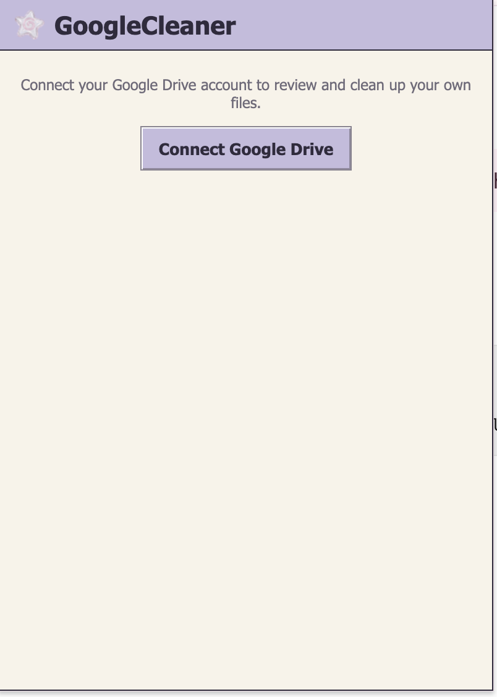
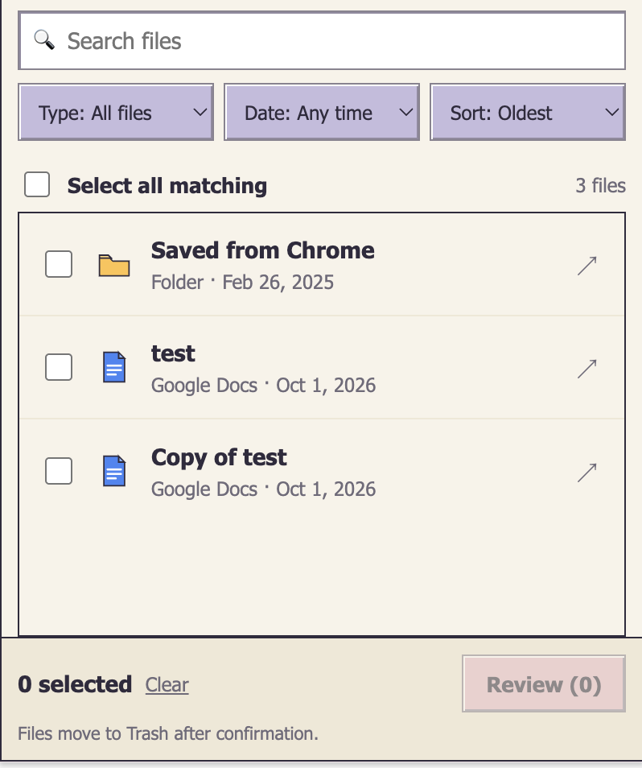

# GoogleCleaner

A personal Chrome extension for reviewing your own Google Drive files and moving selected items to Trash.

*Connect screen, shown before signing in with Google.*

*File list with search, type/date/sort filters, and selection before review.*

## Features

- Sign in with your own Google account via `chrome.identity`
- Browse your Drive files with search, file-type filter, last-modified filter, and sorting
- Select individual files or folders, review the selection, then move them to Trash
- Background cleanup job with progress and retry, so closing the popup doesn't cancel it

## Install locally

This extension isn't published on the Chrome Web Store — load it as an unpacked extension:

1. Open `chrome://extensions`, enable **Developer mode**, and **Load unpacked** the `extension/` folder.
2. Follow [`extension/README.md`](extension/README.md) to set up your own Chrome Extension OAuth client and configure it in `extension/manifest.json`.

## How cleanup works

Selecting items and confirming **Move to Trash** moves only those explicitly selected items to Google Drive's Trash — the same as Drive's own "Remove" action. Nothing is permanently deleted and Trash is never emptied by this tool.

See [`privacy.html`](privacy.html) for the privacy policy.

